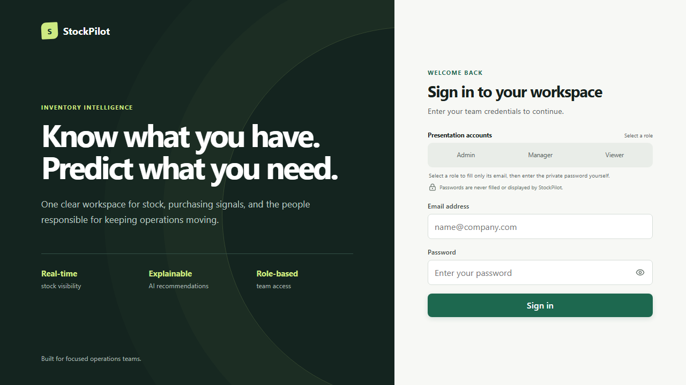
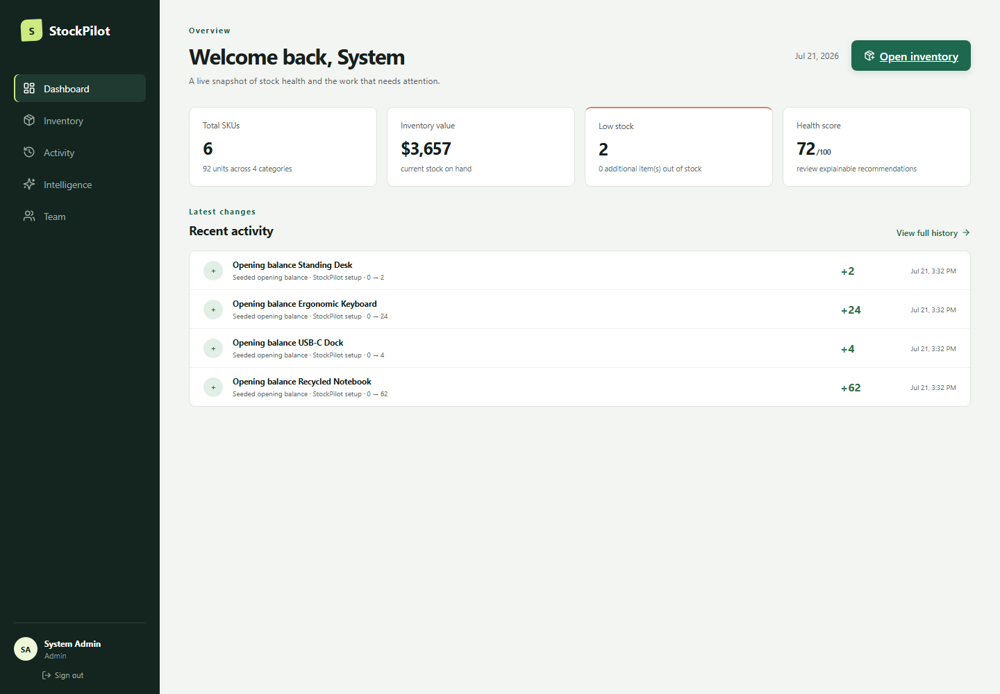
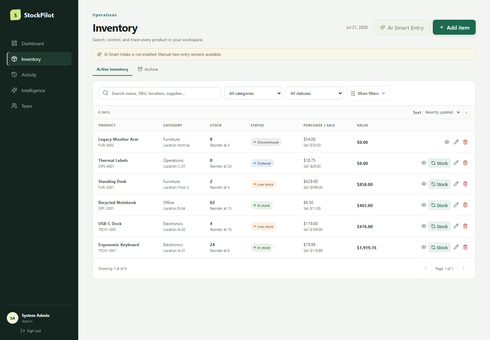

# StockPilot Inventory Management

StockPilot is an inventory-management application built with ASP.NET Core 8, React, TypeScript, EF Core, and SQL Server. It combines reliable stock-control workflows, explainable replenishment recommendations, and an optional review-before-save AI intake assistant.

## Features

- Create, edit, search, filter, paginate, and archive inventory items
- Discover and restore archived items without losing their movement or audit history
- Separate lifecycle (`Active`, `Discontinued`) from procurement (`None`, `Ordered`)
- Derive display status consistently: `Discontinued`, `Ordered`, `OutOfStock`, `LowStock`, or `InStock`
- Search name, SKU, category, description, location, and supplier
- Keep debounced filters, sorting, and pagination in the URL for shareable inventory views
- Switch to purpose-built inventory cards on mobile instead of a cramped table
- Open dedicated dashboard, item detail, complete activity, intelligence, and team routes
- Receive, issue, return, damage, and correct stock through an attributable movement ledger
- Make stock requests idempotent so a network retry cannot apply the same movement twice
- Prevent negative stock, silent quantity overwrites, and stale-version updates
- Retain archived items, movement history, and audit events
- Track purchase price, selling price, and workspace currency
- Isolate inventory and team memberships by workspace
- Enforce Admin, Manager, and Viewer permissions in the API
- Authenticate with ASP.NET Core Identity and HttpOnly same-origin cookies
- Require antiforgery tokens for every state-changing API request
- Lock accounts temporarily after repeated failed sign-in attempts
- Show inventory health, stockout alerts, suggested order quantities, category exposure, and recent activity
- Turn a natural-language item description into a validated, editable AI draft without saving it automatically
- Provide accessible loading, empty, error, validation, and confirmation states
- Paginate complete stock activity instead of silently truncating history
- Enforce production security headers and a stable 64 KB general API request limit
- Return consistent RFC 7807 errors with stable codes and trace identifiers

## Product screenshots

### Secure workspace sign-in



### Inventory operations dashboard



### Searchable status-aware inventory



## Roles

Permissions are enforced by the API; frontend visibility is only a usability aid.

| Capability | Admin | Manager | Viewer |
|---|:---:|:---:|:---:|
| View inventory, activity, dashboard, and intelligence | Yes | Yes | Yes |
| Search, filter, sort, and paginate | Yes | Yes | Yes |
| Create items and edit metadata | Yes | Yes | No |
| Receive, issue, return, damage, and correct stock | Yes | Yes | No |
| Generate and review Smart Intake drafts | Yes | Yes | No |
| Archive and restore inventory | Yes | No | No |
| Manage team members and roles | Yes | No | No |

## Simplest Windows setup

Install:

- [.NET 8 SDK](https://dotnet.microsoft.com/download/dotnet/8.0)
- [Node.js 20.12 or newer](https://nodejs.org/)
- SQL Server LocalDB, included with Visual Studio or SQL Server Express
- SSMS only if you want a graphical database viewer; the application does not require it

Open PowerShell in the repository and start LocalDB:

```powershell
SqlLocalDB start MSSQLLocalDB
```

Start the API:

```powershell
$env:SeedDemoPassword = "CHOOSE_A_PRIVATE_LOCAL_PASSWORD"
dotnet run --project backend --urls http://localhost:5000
```

The API applies EF Core migrations and creates the `StockPilot` database automatically. Keep that terminal open.

In a second PowerShell window, start the frontend:

```powershell
Set-Location frontend
npm install
npm run dev
```

Open <http://localhost:5173>. No Docker commands or manual SQL scripts are needed.

The three optional local demonstration accounts use the private password supplied through `SeedDemoPassword`. No demo password is committed or displayed by the application:

| Role | Email |
|---|---|
| Admin | `admin@stockpilot.local` |
| Manager | `manager@stockpilot.local` |
| Viewer | `viewer@stockpilot.local` |

Authentication cookies are created by the API and never exposed to JavaScript. Change or disable the seeded accounts before public deployment.

## Optional Smart Intake configuration

Smart Intake is disabled by default, so the complete manual inventory workflow works without an AI account or API key. Gemini Flash-Lite is the recommended provider for a no-cost demonstration. To enable it for local development, set the server-side variables in the API terminal before starting the backend:

```powershell
$env:AI__SmartIntake__Enabled = "true"
$env:AI__SmartIntake__Provider = "Gemini"
$env:AI__SmartIntake__Model = "gemini-3.5-flash-lite"
$env:AI__SmartIntake__Endpoint = "https://generativelanguage.googleapis.com/v1beta/openai/chat/completions"
$env:AI__SmartIntake__ApiKey = "YOUR_GEMINI_API_KEY"
dotnet run --project backend --urls http://localhost:5000
```

The OpenAI Responses API remains supported by selecting provider `OpenAI`, model `gpt-5.6-sol`, and endpoint `https://api.openai.com/v1/responses`. `AI__SmartIntake__Model`, `AI__SmartIntake__Endpoint`, and `AI__SmartIntake__TimeoutSeconds` can be overridden without changing source. Never place a real provider key in `appsettings.json`, `.env`, Git, browser code, or deployment files; use environment variables or the hosting platform's secret store.

Only Admins and Managers can request drafts. Input is bounded, rate limited, sent by the backend, constrained to a strict schema, and validated again after deserialization. Provider output only fills the ordinary item form: a person must review or edit the highlighted suggestions and explicitly select **Add item** before anything is persisted. If the provider is disabled or unavailable, the original description and manual workflow remain available.

## Inspect the database with SSMS

1. Open SQL Server Management Studio.
2. Set **Server name** to `(localdb)\MSSQLLocalDB`.
3. Select **Windows Authentication** and connect.
4. Expand **Databases → StockPilot → Tables**.

SSMS is a database administration client. SQL Server LocalDB is the relational database used by the app. To use another SQL Server instance, override `ConnectionStrings__DefaultConnection`; do not edit source code or commit credentials.

```powershell
$env:ConnectionStrings__DefaultConnection = "Server=YOUR_SERVER;Database=StockPilot;Trusted_Connection=True;Encrypt=True;TrustServerCertificate=True"
dotnet run --project backend
```

## Architecture

```text
backend/
  Contracts/       Request and response models at the HTTP boundary
  Controllers/     Thin authenticated API endpoints
  Data/            EF Core context, migrations, and deterministic seed
  Models/          Workspace-scoped entities, statuses, and roles
  Services/        Inventory, authentication, intelligence, and AI-provider boundaries
  Tests/           Fast SQLite-backed business-invariant tests
frontend/src/
  app/             Router and server-state providers
  features/        Authentication and inventory foundations
  components/      Application shell, route pages, and focused React UI
  api.ts           Typed cookie/antiforgery HTTP client
  types.ts         Shared frontend domain types
```

SQL Server is the application database. The test project uses isolated in-memory SQLite databases for fast service and HTTP integration tests; the SQL Server migrations and constraints are additionally verified against LocalDB. The production API serves the compiled SPA so a deployment can use one application URL.

## Tests and builds

```powershell
dotnet test backend/Tests/InventoryApi.Tests.csproj --configuration Release
Set-Location frontend
npm run check
npm run test:e2e:install # first run only
npm run test:e2e
```

The frontend check enforces formatting, zero-warning linting, application and E2E TypeScript, the complete unit/DOM suite, and a production build. The backend test suite treats compiler and recommended analyzer warnings as errors.

Playwright covers Manager creation, Viewer restrictions, Admin team-member removal, stock adjustment and activity, status boundaries, AI draft review, automated WCAG A/AA checks, and mobile cards/overflow/touch targets. The E2E runner is Windows/LocalDB based and does not require Docker. It uses ports `5100` and `5175`, deletes only the explicitly named disposable `StockPilotE2E` database before and after the run, and never touches the normal `StockPilot` database. The AI browser scenario intercepts only the external extraction response; preview verification and the final explicit inventory save still use the real application API and SQL Server database.

GitHub Actions runs the backend/frontend/container pipeline on Ubuntu and the focused Chromium workflows on `windows-2022`, where SQL Server LocalDB is available, then uploads Playwright reports for diagnosis.

## Inventory integrity

Quantity is never changed through ordinary metadata editing. Every change creates a movement in the same transaction with a request ID, type, reason, operator, previous quantity, new quantity, and timestamp. The request ID makes retries safe, database constraints reject negative stock, and a version token detects stale edits. Archiving hides an item from active inventory without removing its history.

## Intelligence and Smart Intake

The inventory-insights screen remains deterministic and explainable. It detects at-risk products, scores risk against reorder levels, recommends stock for two reorder cycles plus a safety buffer, and aggregates category exposure. It is not presented as demand forecasting; movement history is the data foundation for a later forecasting model.

Smart Intake is a separate optional generative feature. It converts untrusted natural-language input into a typed draft only. The provider has no database access, failures never fabricate a draft, and no AI response can create or update inventory automatically.

## API summary

| Method | Endpoint | Access |
|---|---|---|
| `POST` | `/api/auth/login` | Public |
| `GET` | `/api/auth/antiforgery` | Public |
| `GET` | `/api/auth/me` | Authenticated |
| `POST` | `/api/auth/logout` | Authenticated |
| `GET` | `/api/inventory` | All roles |
| `GET` | `/api/inventory/categories` | All roles |
| `GET` | `/api/inventory/summary` | All roles |
| `GET` | `/api/inventory/movements` | All roles |
| `GET` | `/api/inventory/archived` | Admin |
| `POST` | `/api/inventory` | Admin, Manager |
| `PUT` | `/api/inventory/{id}` | Admin, Manager |
| `PATCH` | `/api/inventory/{id}/stock` | Admin, Manager |
| `DELETE` | `/api/inventory/{id}` | Admin |
| `POST` | `/api/inventory/{id}/restore` | Admin |
| `GET` | `/api/ai/insights` | All roles |
| `GET` | `/api/ai/inventory-draft/availability` | Admin, Manager |
| `POST` | `/api/ai/inventory-draft` | Admin, Manager |
| `GET` | `/api/users` | Admin |
| `POST` | `/api/users` | Admin |
| `PATCH` | `/api/users/{id}/role` | Admin |
| `DELETE` | `/api/users/{id}` | Admin |
| `GET` | `/api/health` | Public |
| `GET` | `/api/health/live` | Public |

Inventory queries accept `search`, `category`, `supplier`, `location`, `minQuantity`, `maxQuantity`, `status`, `sortBy`, `descending`, `page`, and `pageSize`. Page size is bounded to 100. Supported sorts are updated time, name, SKU, category, quantity, purchase price, selling price, inventory value, location, and supplier.

Movement queries accept optional `itemId` plus `page` and `pageSize`; page size is bounded to 100. The response uses the same `items`, `total`, `page`, `pageSize`, and `totalPages` envelope as inventory search.

API failures use RFC 7807 Problem Details. In addition to human-readable `title` and `detail`, every error includes a stable `code` for client behavior and a `traceId` for support diagnostics.

## Deployment

The live demonstration is available at **[stockpilot-alibarakeh.azurewebsites.net](https://stockpilot-alibarakeh.azurewebsites.net)**.

It runs the compiled React and ASP.NET application on Azure App Service Free F1, backed by an Azure SQL Database free-offer database. The SQL free-limit behavior is auto-pause rather than billable overage, and the server firewall accepts only the web app's possible outbound addresses. Gemini Smart Intake calls Google only from the backend; its key is held in encrypted App Service settings and never sent to the browser. Formal EF migrations run during deployment startup, Data Protection keys persist in SQL Server, and temporary first-Admin bootstrap secrets were removed after provisioning.

Production exposes `/api/health/live` for process liveness and `/api/health` for database/schema readiness. Free App Service and free Azure SQL can cold-start after inactivity and do not provide a production uptime SLA, so this deployment is intended for evaluation and portfolio demonstrations.

The root `Dockerfile` and `compose.yaml` provide a CI-validated portable container option. Docker is not required for local development or the Azure deployment.

## Current limitations

- The schema is workspace-scoped, but workspace provisioning and switching are not exposed in the UI.
- Quantities are integers; fractional inventory is outside the current scope.
- Replenishment guidance is deterministic and explainable, not trained demand forecasting.
- Smart Intake requires a server-side provider key and remains disabled in unconfigured environments.
- Purchase orders, barcode scanning, batch/lot/serial tracking, and accounting integrations are not included.
- Password reset, email verification, two-factor authentication, and enterprise SSO journeys are not exposed.
